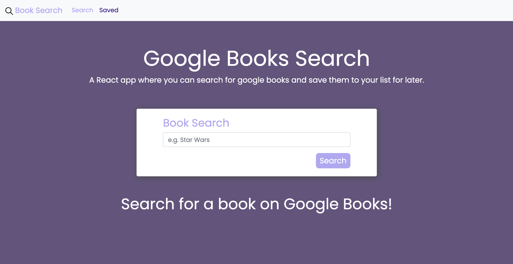

# 
Book Search

## About 📚 

Built with React front end and Node/Express back end, this app makes easy use of the google books api. A user can search for any google book title and either click the link to the book or save the book to a list for easy access later. Once on the save list, a user can click to view the book or delete the book from the saved list.

***
## Table of Contents
1. [License](#license)
2. [Screenshots](#screenshots)
3. [Languages & Technologies](#languages-&-technologies)
4. [Contributing](#contributing)
5. [Contact Me](#contact-me)

***
## License

***
## Previews

<kbd></kdb>

***

***
## Languages & Technologies

* React
* HTML
* CSS
* Node
* Express
* JavaScript
* BootStrap
* MongoDB
* Mongoose
* Heroku

***
## Contributing

jeffreymcfarland

***
## Contact Me    

<kbd></kbd> 
* Email: <jlmcfarlandj@gmail.com>

